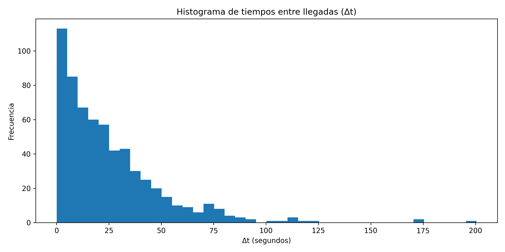

# Resultados

En esta sección se presentan los resultados del análisis estadístico aplicado a los intervalos de tiempo entre eventos (`Δt`). Se incluyen estadísticas descriptivas, visualizaciones, el ajuste del modelo exponencial y una prueba formal de bondad de ajuste.

---

## Estadísticas descriptivas

Se calcularon diferencias temporales entre muestras consecutivas mediante:

\[
\Delta t_i = t_{i} - t_{i-1}
\]

Los valores descriptivos calculados para los 620 intervalos fueron:

| Estadístico | Valor |
|------------|----------------|
| Count | 620 |
| Media (s) | 25.2448 |
| Desviación estándar (s) | 24.6579 |
| Mínimo (s) | 0.0488 |
| 25% | 7.3654 |
| Mediana | 19.1518 |
| 75% | 34.5390 |
| Máximo (s) | 200.4512 |

Estos valores sirven como referencia para comprender la variabilidad y escala temporal del proceso, los cuales son carácteristicas típicas de procesos con componente aleatoria significativa.

---

## Histograma de los intervalos Δt

El siguiente gráfico muestra la distribución empírica:

La forma decreciente del histograma ya sugiere compatibilidad con una distribución exponencial, donde los valores pequeños de `Δt` son más probables que los grandes.

---

## Ajuste de una distribución exponencial

La distribución exponencial tiene función de densidad:

\[
f(x) = \lambda e^{-\lambda x}, \qquad x \ge 0
\]

El parámetro se ajustó por máxima verosimilitud:

\[
\hat{\lambda} = \frac{1}{\bar{x}}
\]

Sustituyendo el valor de la media muestral:

\[
\hat{\lambda} = \frac{1}{25.24475} \approx 0.03961
\]

El ajuste visual se muestra a continuación, donde se superpone la curva teórica sobre el histograma normalizado:

El modelo captura correctamente la forma general de los datos, especialmente para valores bajos y medios del soporte.

---
### Construcción de la curva teórica

Para superponer el modelo sobre el histograma, se generó un conjunto de puntos entre 0 y el máximo valor de Δt:

\[
x \in [0, \max(\Delta t)]
\]

Luego se evaluó la función de densidad exponencial:

\[
f(x) = \hat{\lambda} e^{-\hat{\lambda} x}
\]

con el parámetro estimado:

\[
\hat{\lambda} = 0.03961
\]

Esta curva se normaliza automáticamente al graficarse sobre un histograma con densidad (`density=True`), permitiendo comparar forma y escala del modelo teórico con la distribución empírica observada.

---

## Prueba de bondad de ajuste (Kolmogorov–Smirnov)

Para evaluar rigurosamente si los datos provienen de una distribución exponencial, se aplicó la prueba KS.  

El estadístico KS se define como:

\[
D = \sup_x | F_n(x) - F(x) |
\]

donde:
- \( F_n(x) \) es la función de distribución empírica,
- \( F(x) \) es la CDF de la exponencial ajustada.

Los resultados fueron:

- **D = 0.03494**  
- **p-value = 0.42590**

Dado que:

\[
p\_value > 0.05
\]

se concluye que:

> **No se rechaza la hipótesis de que los datos provienen de una distribución exponencial al 95% de confianza.**

Esto respalda fuertemente el modelo utilizado.

---

## Propiedad de memoria nula

De acuerdo con el modelo exponencial, el proceso debería cumplir:

\[
P(X > t + s \mid X > s) = P(X > t)
\]

La propiedad indica que el tiempo restante hasta el próximo evento no depende del tiempo ya transcurrido, característica fundamental de procesos de Poisson.

---

## Análisis preliminar

El comportamiento observado de `Δt`, tanto visual como estadísticamente, es consistente con un **proceso de Poisson**, donde las llegadas se modelan mediante una distribución exponencial con parámetro:

\[
\lambda = 0.03961
\]

Este resultado valida el uso de modelos estocásticos de tipo Poisson para describir el sistema bajo estudio y será utilizado como soporte para las conclusiones generales del proyecto.
